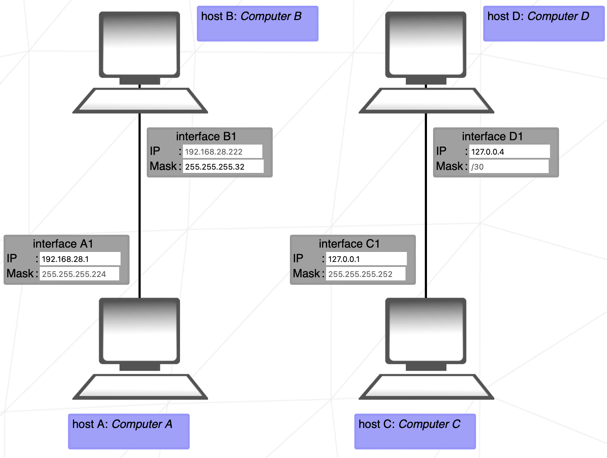
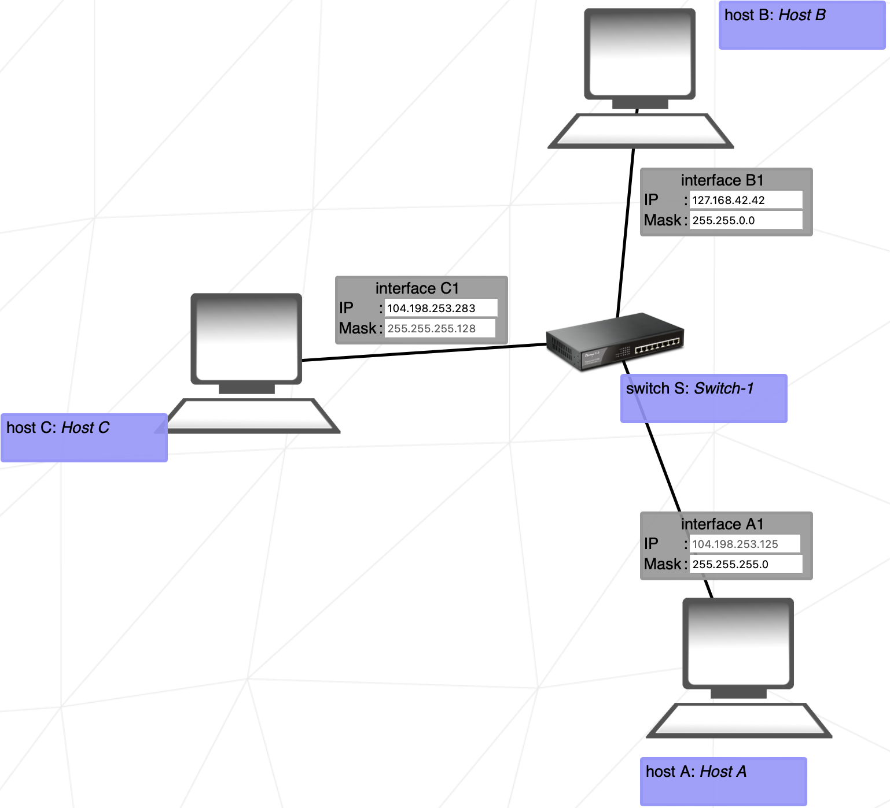
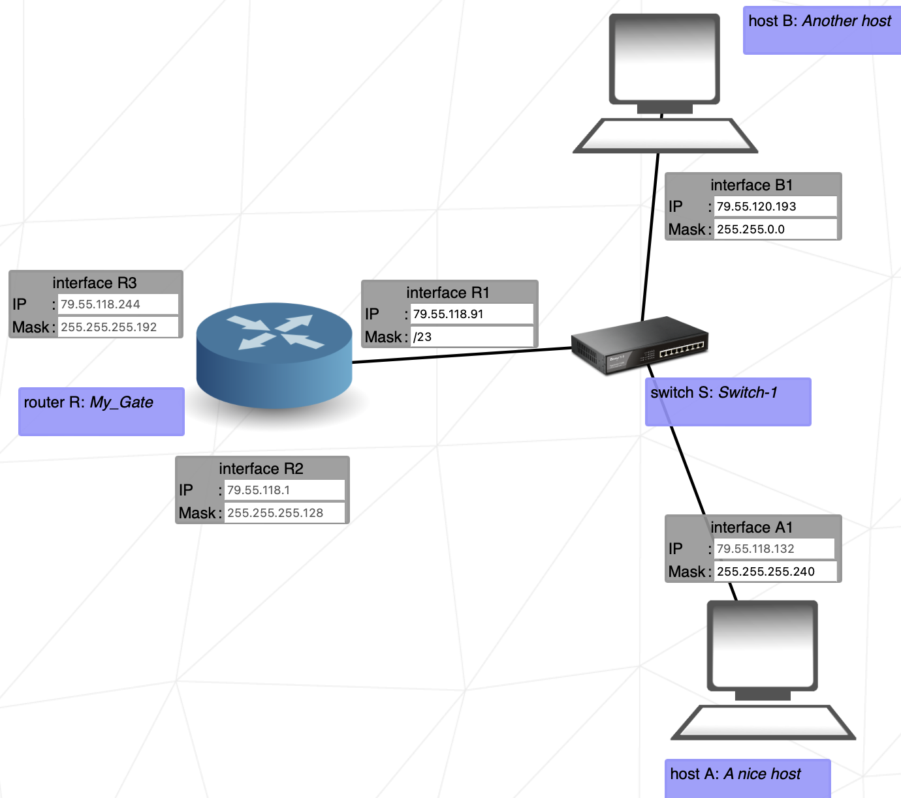
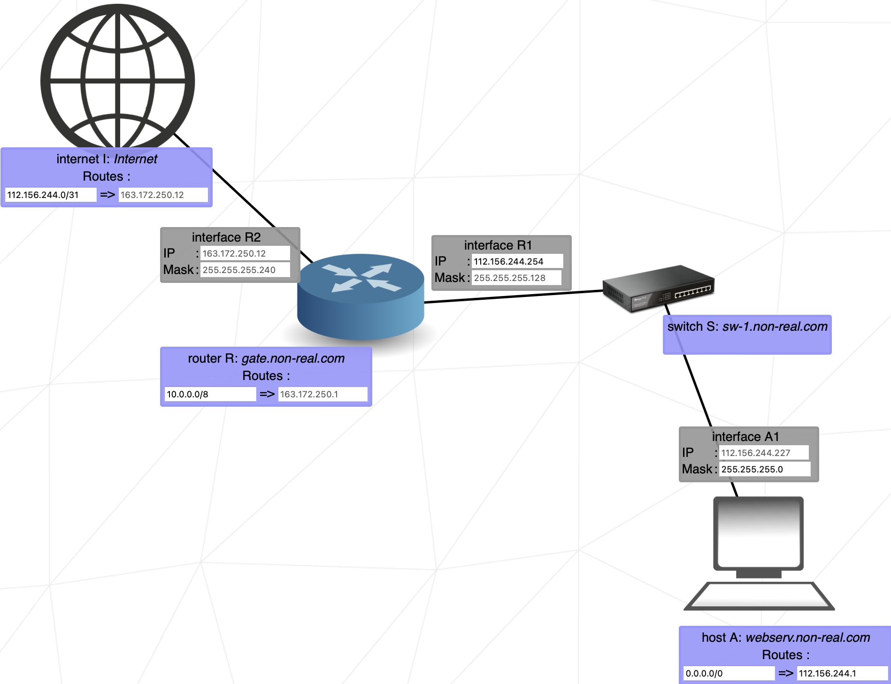
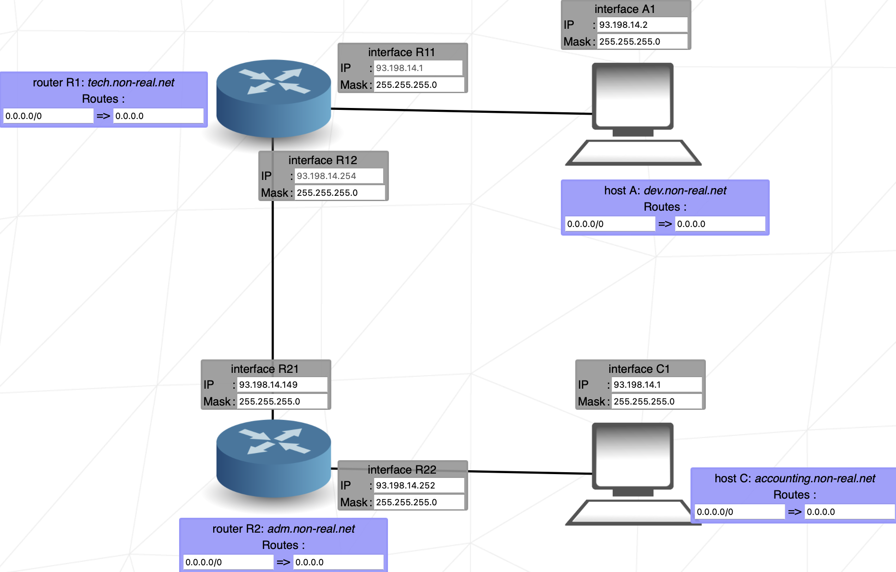
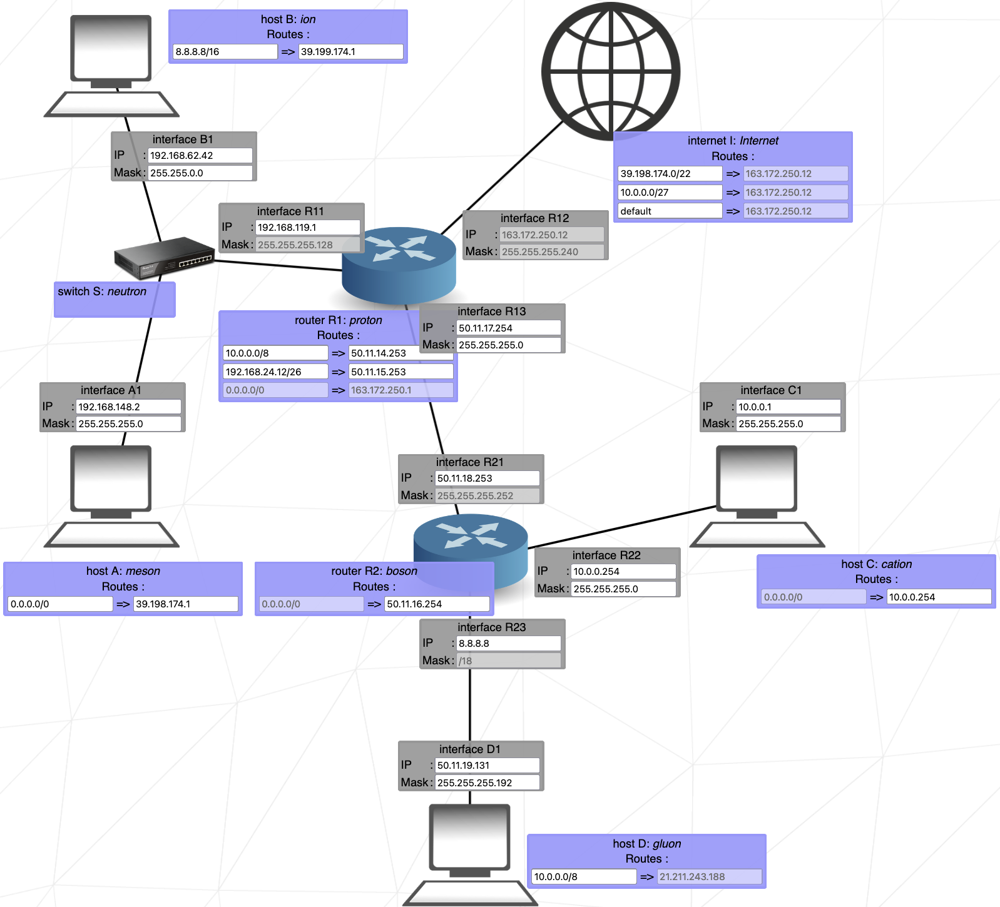

# 42_NetPractice
his document is a System Administration related exercise.

## How to Calculate the Range in a Network

To calculate the **range** of a network (i.e., the range of valid IP addresses), you need two main pieces of information: the **IP address** and the **subnet mask**. Let’s use the example you provided, with the IP `104.99.23.240` and the subnet mask `255.255.255.0`.

### Steps to Calculate the Network Range:

#### 1. **Identify the Network and Host Portions:**
   The subnet mask `255.255.255.0` (or `/24` in CIDR notation) indicates that the first **24 bits** of the IP are for the **network**, and the last **8 bits** are for the **hosts**.

   - **IP in decimal**: `104.99.23.240`
   - **Subnet mask in decimal**: `255.255.255.0`
   - **IP in binary**: `01101000.01100011.00010111.11110000`
   - **Mask in binary**: `11111111.11111111.11111111.00000000`

   The subnet mask `255.255.255.0` means that the first three octets (`104.99.23`) represent the **network**, and the last octet (`240`) represents the **hosts**.

#### 2. **Find the Network Address:**
   The **network address** is obtained by performing a bitwise AND operation between the IP address and the subnet mask.

   - **IP in binary**: `01101000.01100011.00010111.11110000`
   - **Mask in binary**: `11111111.11111111.11111111.00000000`

   Performing the AND operation:

- 01101000.01100011.00010111.11110000 (IP)
- AND
- 11111111.11111111.11111111.00000000 (Máscara)
- 01101000.01100011.00010111.00000000 (Resultado: 104.99.23.0)

Therefore, the **network address** is `104.99.23.0`.

#### 3. **Find the Broadcast Address:**
The **broadcast address** is the last address in the network and is obtained by setting all the **host bits** to 1.

- For a `/24` mask, the first 24 bits are for the network and the last 8 bits are for hosts.
- The host portion in the broadcast address will be `11111111` (in binary), which is `255` in decimal.

Therefore, the **broadcast address** is:
- **Broadcast address**: `104.99.23.255`.

#### 4. **Calculate the Usable IP Range:**
The range of valid IP addresses (hosts) goes from the first IP **after the network address** to the last IP **before the broadcast address**.

- **First usable IP**: `104.99.23.1` (the next address after `104.99.23.0`).
- **Last usable IP**: `104.99.23.254` (the address before the broadcast `104.99.23.255`).

### Summary of Results:

- **Network address**: `104.99.23.0`
- **Broadcast address**: `104.99.23.255`
- **Usable IP range**: from `104.99.23.1` to `104.99.23.254`

Thus, with the IP `104.99.23.240` and the subnet mask `255.255.255.0`, the range of usable IPs goes from `104.99.23.1` to `104.99.23.254`.

## Exercise 1

## Goal 1 : host my PC needs to communicate with host my little brother's computer

### Network Information:
- **Hosts A and B** are on the same network.
- The subnet masks are pre-filled and locked.

### Subnet Mask Details:
- **Subnet Mask (Decimal):** `255.255.255.0`
- **Subnet Mask (Binary):** `11111111.11111111.11111111.00000000`
- **CIDR Notation:** `/24`

### Explanation:
- The first **24 bits** (3 bytes) represent the **network portion**.
- The last **8 bits** (1 byte) represent the **host portion**.

Since both hosts are on the same network, there is no need to change the subnet mask.

### IP Address Range:
- **Usable IP Range:** `104.96.23.1` to `104.96.23.254`
- **Exception:** `104.96.23.12` is already assigned to **Client B1**.

### Important Notes:
- The first address in the range, `104.96.23.0`, is reserved as the **network address**.
- The last address in the range, `104.96.23.255`, is reserved as the **broadcast address**.

---

## Goal 2 : host my Mac needs to communicate with host my little sister's computer

### Network Information:
- **Hosts C and D** are on the same network.
- The subnet masks are pre-filled and locked.

### Subnet Mask Details:
- **Subnet Mask (Decimal):** `255.255.0.0`
- **Subnet Mask (Binary):** `11111111.11111111.00000000.00000000`
- **CIDR Notation:** `/16`

### Explanation:
- The first **16 bits** (2 bytes) represent the **network portion**.
- The last **8 bits** (2 bytes) represent the **host portion**.

Now, the subnet mask is 255.255.0.0 - In this case, the first 2 octects(2 bytes) will represent the network and the other 2 will represent the host.
Since both hosts are on the same network, there is no need to change the subnet mask.
Because the have the last 2 bits for the hosts, the range for hosts will be bigger.

### IP Address Range:
- **Usable IP Range:** `211.191.1.0` to `211.191.255.254`
- **Exception:** `211.191.31.75` is already assigned to **Client C1**.
- Here we are already having in consideration the network and broadcast.

---

## Exercise 2

## Goal 1 : host Computer B needs to communicate with host Computer A

### Network Information:
- Host B and host A are on the same network
- Subnet Mask of host A is filled and locked.

### Subnet Mask Details:
- **Subnet Mask (Decimal):** `255.255.255.224`
- **Subnet Mask (Binary):** `11111111.11111111.11111111.11100000`
- **CIDR Notation:** `/27`

### Explanation:
- The first **27 bits** represent the **network portion**.
- The last **5 bits** represent the **host portion**.
- This allows for 32 IP addresses per subnet (since 2^5 = 32).

- The subnet mask of the host A is filled and locked.
- The ip of host B is filled and locked with ip **192.168.28.222 (11000000.10101000.00011100.11011110)**
Since hosts B and A are on the same network, the subnet mask will be the name for both.
Since we know that we can change only the last 5 bits for the hosts and this subnet mask allows 32 hosts,
we can calculate the range as:

| **Network Address** | **Broadcast Address** | **Usable IP Range**                |
|---------------------|-----------------------|------------------------------------|
| 192.168.28.0        | 192.168.28.31         | 192.168.28.1 - 192.168.28.30       |
| 192.168.28.32       | 192.168.28.63         | 192.168.28.33 - 192.168.28.62      |
| 192.168.28.64       | 192.168.28.95         | 192.168.28.65 - 192.168.28.94      |
| 192.168.28.96       | 192.168.28.127        | 192.168.28.97 - 192.168.28.126     |
| 192.168.28.128      | 192.168.28.159        | 192.168.28.129 - 192.168.28.158    |
| 192.168.28.160      | 192.168.28.191        | 192.168.28.161 - 192.168.28.190    |
| **192.168.28.192**  | **192.168.28.223**    | **192.168.28.193 - 192.168.28.222**|

### IP Address Range:
- **Usable IP Range:** `192.168.28.193` to `192.168.28.221`
- **Network address**: `192.168.28.192`
- **Broadcast address:** `192.168.28.223`
- **Exception:** `192.168.28.222` is already assigned to **Host B**.

## Goal 2 : host Computer D needs to communicate with host Computer C

### Network Information:
- Host D and host C are on the same Network
- SubnetMask are already filled on both. They are the same, but in different representations.

### Subnet Mask Details:
- **Subnet Mask (Decimal):** - 255.255.255.252.
- **Subnet Mask (Binary):** - `11111111.11111111.11111111.11111100`
- **CIDR Notation:** - /30

### Explanation:
- The first **30 bits** represents the network. The last **2 bits** represents the hosts.
- This allows for 4 IP addresses per subnet (since 2^2 = 4).
- Since the IP address 127.0.0.1 is reserved. It is known as the loopback address, and the mask that is a Class C mask, we will work with the 192.168.28.x ips.

### IP Address Range:

| **Network Address** | **Broadcast Address** | **Usable IP Range**                |
|---------------------|-----------------------|------------------------------------|
| **192.168.28.0**    | **192.168.28.3**      | **192.168.28.1 - 192.168.28.2**    |
| 192.168.28.4        | 192.168.28.7          | 192.168.28.33 - 192.168.28.62      |
| 192.168.28.8        | 192.168.28.11         | 192.168.28.65 - 192.168.28.94      |
| and there goes      | and there goes        | and there goes                     |
| 192.168.28.252      | 192.168.28.255        | 192.168.28.253 - 192.168.28.254    |

### IP Address Range:
- **Usable IP Range:** `192.168.28.1` to `192.168.28.2`
- **Network address**: `192.168.28.0`
- **Broadcast address:** `192.168.28.3`

---

## Exercise 3

This exercise introduces us to the usage of a switch. 
This device links multiple hostsof the same network together.

### Network Information:
- Host A, host B and Host C are on the same network
- The Mask of Host C is filled and locked.
- The Host A ip is filled and locked.

With this information, we know that all the masks will be the same 
and we are also able to calculate the range of the ips.

### Subnet Mask Details:
- **Subnet Mask (Decimal):** - `255.255.255.128`
- **Subnet Mask (Binary):** - `11111111.11111111.11111111.10000000`
- **CIDR Notation:** - /25

### Explanation:
- The first **25 bits** represents the network. The last **7 bits** represents the hosts.
- This allows for 128 IP addresses per subnet (since 2^7 = 128).

## IP Range
- **Ip filled and locked** - `104.198.253.125`
- **Binary Representation** - `01101000.11000110.11111001.01111101`

### IP Address Range:

| **Network Address** | **Broadcast Address** | **Usable IP Range**                  |
|---------------------|-----------------------|--------------------------------------|
| **104.198.253.0**   | **104.198.253.127**   | **104.198.253.1 - 104.198.253.126**  |

### IP Address Range:
- **Usable IP Range:** `104.198.253.1` to `104.198.253.126`
- **Network address**: `104.198.253.0`
- **Broadcast address:** `104.198.253.127`

We need to fill all three ips inside this range, without repeating and the exercise is solved.

## Exercise 4

This exercise introduces the router.
This device is used to link multiple networks together, it does so with the use of multiple interfaces.

### Network Information:
- Masks are not filled on Host A and Host B and they are on the same network, so we can chose. I will chose something easy. 255.255.255.0 -> /24 in CIDR notation.
- Host A have an IP filled and locked (**79.55.118.132**).
- Interfaces R3 and R2 have all the informations locked.
- Interface R1 have submask and ip free to chose.

Since we can chose the mask, i will chose and easy one that doesnt recquire any calculations.
for the mask /24, we know that the range will be 79.55.118.1 to 79.55.118.254(having in consideration that the first and the last are reserved).
The IP address of Host B and Interface R1 must have the same network address as the IP address of Interface A1 and the same submask.

Fill all three with the same Mask and in the IP range described above and the exercise is solved.
We don't touch on Interface R2 and R3 because none of our communications have to reach that side of the router.

---

## Exercise 5

This exercise introduces the concept of **routes** in networking.

What is a Route?
   A **route** is a set of instructions used by routers to determine how to send packets from one network to another. When data needs to travel across networks, it follows these routes to reach its intended destination.

Components of a Route:
   A route consists of two key fields:

1. Destination
- The **destination** is the address of the endpoint where the data is intended to go. It can refer to a specific device (such as a computer or server) or a broader network.
- **Example:** If you're sending data to a website, the destination would be the IP address of that website.
The destination default is equivalent to 0.0.0.0 /0, this will forward the packets to the first applicable network address it finds. For instance, if the destination address is 123.4.5.6/24, the packets will be directed to the network 123.4.5.0.

2. Next Hop
- The **next hop** specifies the next router (or internet or device) that should receive the packets on their way to the destination.
- This field is crucial for routing as it determines the immediate path the packets will take.
- **Example:** If the destination is on a different network, the packet may first be sent to a local router (the next hop), which then forwards it to the appropriate network.

## Network information
- interfaces A1 and B1 ips and masks have open field to change the values.
- Host A routes have destination and next hop open fields to change the values.
- Host B routes have destination filled as default and lock and next hop field open to change the value.
- Interface R1 and R2 have locked ips and masks.

## Goal 1 : host Machine A needs to communicate with host The Mighty Router

To make the host Machine A to communicate with the Mighty Router, we need to check in which interface of the router we are in touch. In this case, is the interface R1.

Interface R1 have the Ip and submask fields filled and locked.
The mask is 255.255.255.128 -> /25 in CIDR notation.
The ip is 45.227.104.126.

With this informations we know that Machine A needs to have the same mask as interface R1 and the IP needs to be inside the range of R1 ips.

We also can know that the number of hosts on the network is 128. Because 2^7 = 128.
Then, the range is 45.227.104.1 - 45.227.104.126 (Having in consideration the hosts and broadcast)

Host A route
We can define the destination as default, because there is only 1 route through which it can send its packets.
The next hop address must be the IP address of the next router's interface on the packets' way.
The next interface is Interface R1, with the IP address of 54.117.30.126. Note that the next interface is not Interface A1, since this is the sender's own interface.

Doing this, we will solve this goal.

---

## Goal 2 : host Machine B needs to communicate with host The Mighty Router

We will use the same logic as the exercise before.
Interface R2 Has IP and Mask filled and locked.
The mask is 255.255.192.0 -> /18 in CIDR notation.
The IP is 170.71.188.254.

With this informations we know that Machine B needs to have the same mask as interface R2 and the IP needs to be inside the range of R2 ips.

We also can know that the number of hosts on the network is 128. Because 2^6 = 64.
Then, the range is 170.71.188.193 - 170.71.188.254 (Having in consideration the hosts and broadcast).

Host B route
The destination is already filled with default.
The next hop address must be the IP address of the next router's interface on the packets' way.
The next interface is Interface R2, with the IP address of 170.71.188.254. Note that the next interface is not Interface B1, since this is the sender's own interface.

Doing this, we will solve this goal.

---

Goal 3 : host Machine A needs to communicate with host Machine B 
Solving the 2 first goals will allow the communications between Machine A and Machine B.

--

## Exercise 6

This exercise introduces internet.
The internet operates similarly to a router, directing data between devices and networks. However, certain IP addresses are reserved for private use and cannot be used on the public internet. Here are the key ranges of reserved IP addresses:

      192.168.0.0 - 192.168.255.255: This range includes 65,536 IP addresses and is commonly used in home networks.

      172.16.0.0 - 172.31.255.255: This range provides 1,048,576 IP addresses and is often utilized by medium-sized networks.

      10.0.0.0 - 10.255.255.255: This range offers 16,777,216 IP addresses and is frequently employed in larger networks.

If a device's interface is connected to the internet, it **cannot** use these private IP addresses. Instead, it must use a public IP address to communicate over the internet.

## Network information
### internet
- destination -> changeble.
- next hop -> 163.172.250.12

### interface R2
- ip -> 163.172.250.12
- submask -> 255.255.255.240 -> CIDR /28

### router R
- destination -> changeble
- next hop -> 163.172.250.1

### interface R1
- ip -> Changeble
- submask -> 255.255.255.128 -> CIDR /25

### interface A1
- ip -> 112.156.244.227
- mask -> changeble

### Host A route
- destination -> changeble
- next hop -> changeble

Next hop of internet is already locked and filled, and matches it ip from interface R2.
Then we need to configurate the destination of the internet, that in this case we need to send packages to host A.
So, internet destination must match with the network of address of interface A1.
A1 mask is changeble, than we can fill this with some easy calculation mask. 255.255.255.0 -> /24 -> This will give us a range of 255.

Calculate internet address of a client:
To calculate this, we need to transform the Interface A1 ip and mask to binary.

`ip 112.156.244.227 -> 01110000.10011100.11110100.11100011`

`mask 255.255.255.0 -> 11111111.11111111.11111111.00000000`

Apply the Subnet Mask to the IP Address

To find the **network address**, apply the subnet mask to the IP address using a bitwise **AND** operation.

    1 AND 1 = 1
    1 AND 0 = 0
    0 AND 1 = 0
    0 AND 0 = 0

| **IP Address**        | `01110000.10011100.11110100.11100011` |
|-----------------------|--------------------------------------|
| **Subnet Mask**        | `11111111.11111111.11111111.00000000` |
| **Network Address**    | `01110000.10011100.11110100.00000000` |

#### 3. Convert the Result to Decimal (Network Address)

Convert the binary result back to decimal:

- `01110000` -> 112
- `10011100` -> 156
- `11110100` -> 244
- `00000000` -> 0

So, the **network address** (internet address of the client) is: **112.156.244.0**.

#### 4. Possible Host Addresses

Since we are using a `/24` subnet mask (255.255.255.0), there are 8 bits left for the host portion, allowing for a range of host addresses from **112.156.244.1** to **112.156.244.254**. 
- The first address `112.156.244.0` is the **network address**.
- The last address `112.156.244.255` is the **broadcast address**.

Now, we need to finish configuring the routes.
All the destinations (except for internet) will be the default.
Host A next hop will be the next interface ip (R1).

## Exercise 7

This level introduces us to the concept of overlaps.
Network overlap occurs when two or more IP address ranges (or subnets) share common addresses. This means that devices in different networks could have IP addresses that fall within the same range, leading to confusion for routers on how to properly route traffic. Essentially, an overlap happens when networks aren't correctly separated, causing ambiguity in IP assignments and routing.
The IP address range of one network should not mix or share any addresses with the range of another network. These networks are kept apart by routers, which help manage and direct traffic between them. If the address ranges overlap, the router won't be able to clearly distinguish which network to send the data to.

## Network information
- 3 seperate networks
- Host A to Router R1
- Router R1 to Router R2
- Router R2 to Host C

- Interface R11 is alread filled with IP 93.198.14.1, because of this, we can't fill freely chose interface A1 ip.
Now, imagine that we give a 255.255.255.0 /024 mas to A1 ip. Lets see the range:

### Subnet Mask Details:
- **Subnet Mask (Decimal):** - 255.255.255.0
- **Subnet Mask (Binary):** - `11111111.11111111.11111111.00000000`
- **CIDR Notation:** - /30
- **Hosts** - 255 (w/ host and broadcast)

| **Network Address** | **Broadcast Address** | **Usable IP Range**                |
|---------------------|-----------------------|------------------------------------|
| 93.198.14.0         | 93.198.14.255         | 93.198.14.1 - 93.198.14.254        |

The IP of interface R12 is **93.198.14.254** and is filled and locked.
So, because of this, we can't use a mask of /24, because it will overlap the range of interface R12.
They would be both in the range of 93.198.14.0 - 93.198.14.255.
Since we need IP addresses for 3 different networks, it's useful to divide the last part of the address into 4 or more smaller address groups. We achieve this by applying a subnet mask of /26 or greater. 
For example, a /28 mask will create 16 smaller groups of addresses, and from these, we will use 3 specific ranges.

### Subnet Mask Details:
- **Subnet Mask (Decimal):** - 255.255.255.0
- **Subnet Mask (Binary):** - `11111111.11111111.11111111.11110000`
- **CIDR Notation:** - /28
- **Hosts** - 16 (w/ host and broadcast)

      93.198.14.1 - 93.198.14.14    (Host A to Router R1)
      93.198.14.65 - 93.198.14.78   (Router R2 to Host C)
      93.198.14.241 - 93.198.14.254 (Router R1 to Router R2)

Useful link
https://www.calculator.net/ip-subnet-calculator.html?cclass=any&csubnet=28&cip=93.198.14.2&ctype=ipv4&printit=0&x=97&y=13

## Exercise 8

## Network information
- Cliente D and Client C needs to communicate between each other and to the internet.
- We have the destiny of the internet filled and locked with ip 131.79.51.0 mask /26

With this information, we can know that all networks must have 131.79.51.x with the range of 62 hosts(excluding network and broadcast)
Then, we know that the internet will communicate with networks with the range of 131.79.51.0 to 131.79.51.63;
But, we need to be careful for not occuring overlaps between the networks.
- Interface D1 has the mask filled and locked 255.255.255.240 /28 , this told us that the networks can have 14 hosts(excluding network and broadcast).

Knowing all this information, we know that the mask is manipulated and the network is splitted in 4.
All the ips are between the range and we need to put any network in a range:

|split| **Network Address** | **Broadcast Address** | **Usable IP Range**                |
|------|---------------------|-----------------------|------------------------------------|
|Host D to router| 131.79.51.0         | 131.79.51.15          | 131.79.51.1 - 131.79.51.14         |
|HOST C to router| 131.79.51.16        | 131.79.51.31          | 131.79.51.17 - 131.79.51.30        |
|router to router| 131.79.51.32        | 131.79.51.63          | 131.79.51.33 - 131.79.51.62        |
|not used| 131.79.51.64        | 131.79.51.128         | 131.79.51.65 - 131.79.51.127       |

- interface R12 ip is filled and locked. With this information we have the next hop of internet.

Now all that we have to do is fill the networks with valid ips from the equivalent range.
All the routes will be default(except for one) and the next hop will be the next interface, just like the other exercises.
- the route from R1 needs to have a destination defined to the specific network that we want to send the packages, that is 131.79.51.0/24.

## Exercise 9

