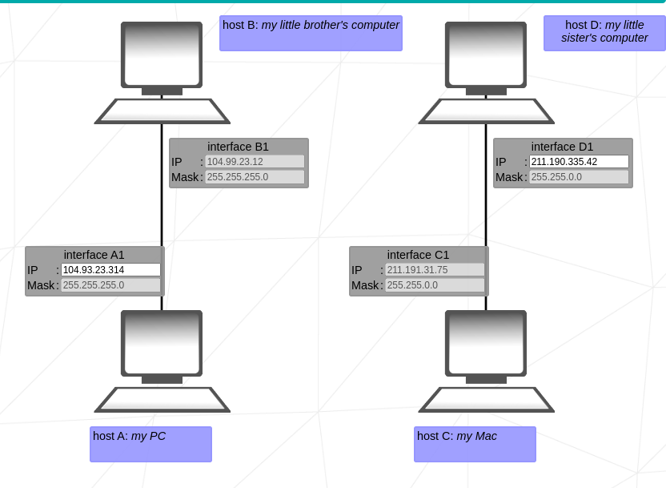

# 42_NetPractice
his document is a System Administration related exercise.

## How to Calculate the Range in a Network

To calculate the **range** of a network (i.e., the range of valid IP addresses), you need two main pieces of information: the **IP address** and the **subnet mask**. Let’s use the example you provided, with the IP `104.99.23.240` and the subnet mask `255.255.255.0`.

### Steps to Calculate the Network Range:

#### 1. **Identify the Network and Host Portions:**
   The subnet mask `255.255.255.0` (or `/24` in CIDR notation) indicates that the first **24 bits** of the IP are for the **network**, and the last **8 bits** are for the **hosts**.

   - **IP in decimal**: `104.99.23.240`
   - **Subnet mask in decimal**: `255.255.255.0`
   - **IP in binary**: `01101000.01100011.00010111.11110000`
   - **Mask in binary**: `11111111.11111111.11111111.00000000`

   The subnet mask `255.255.255.0` means that the first three octets (`104.99.23`) represent the **network**, and the last octet (`240`) represents the **hosts**.

#### 2. **Find the Network Address:**
   The **network address** is obtained by performing a bitwise AND operation between the IP address and the subnet mask.

   - **IP in binary**: `01101000.01100011.00010111.11110000`
   - **Mask in binary**: `11111111.11111111.11111111.00000000`

   Performing the AND operation:

- 01101000.01100011.00010111.11110000 (IP)
- AND
- 11111111.11111111.11111111.00000000 (Máscara)
- 01101000.01100011.00010111.00000000 (Resultado: 104.99.23.0)

Therefore, the **network address** is `104.99.23.0`.

#### 3. **Find the Broadcast Address:**
The **broadcast address** is the last address in the network and is obtained by setting all the **host bits** to 1.

- For a `/24` mask, the first 24 bits are for the network and the last 8 bits are for hosts.
- The host portion in the broadcast address will be `11111111` (in binary), which is `255` in decimal.

Therefore, the **broadcast address** is:
- **Broadcast address**: `104.99.23.255`.

#### 4. **Calculate the Usable IP Range:**
The range of valid IP addresses (hosts) goes from the first IP **after the network address** to the last IP **before the broadcast address**.

- **First usable IP**: `104.99.23.1` (the next address after `104.99.23.0`).
- **Last usable IP**: `104.99.23.254` (the address before the broadcast `104.99.23.255`).

### Summary of Results:

- **Network address**: `104.99.23.0`
- **Broadcast address**: `104.99.23.255`
- **Usable IP range**: from `104.99.23.1` to `104.99.23.254`

Thus, with the IP `104.99.23.240` and the subnet mask `255.255.255.0`, the range of usable IPs goes from `104.99.23.1` to `104.99.23.254`.

## Exercise 1

## Goal 1 : host my PC needs to communicate with host my little brother's computer

### Network Information:
- **Hosts A and B** are on the same network.
- The subnet masks are pre-filled and locked.

### Subnet Mask Details:
- **Subnet Mask (Decimal):** `255.255.255.0`
- **Subnet Mask (Binary):** `11111111.11111111.11111111.00000000`
- **CIDR Notation:** `/24`

### Explanation:
- The first **24 bits** (3 bytes) represent the **network portion**.
- The last **8 bits** (1 byte) represent the **host portion**.

Since both hosts are on the same network, there is no need to change the subnet mask.

### IP Address Range:
- **Usable IP Range:** `104.96.23.1` to `104.96.23.254`
- **Exception:** `104.96.23.12` is already assigned to **Client B1**.

### Important Notes:
- The first address in the range, `104.96.23.0`, is reserved as the **network address**.
- The last address in the range, `104.96.23.255`, is reserved as the **broadcast address**.

---

## Goal 2 : host my Mac needs to communicate with host my little sister's computer

### Network Information:
- **Hosts C and D** are on the same network.
- The subnet masks are pre-filled and locked.

### Subnet Mask Details:
- **Subnet Mask (Decimal):** `255.255.0.0`
- **Subnet Mask (Binary):** `11111111.11111111.00000000.00000000`
- **CIDR Notation:** `/16`

### Explanation:
- The first **16 bits** (2 bytes) represent the **network portion**.
- The last **8 bits** (2 bytes) represent the **host portion**.

Since both hosts are on the same network, there is no need to change the subnet mask.

### IP Address Range:
- **Usable IP Range:** `211.191.31.1` to `211.191.31.254`
- **Exception:** `211.191.31.75` is already assigned to **Client C1**.
- Here we are already having in consideration the network and broadcast.

---

